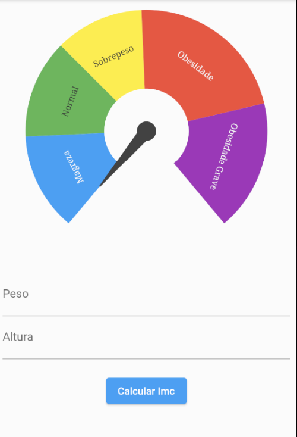

# Flutter Gerência de Estado

No flutter como em outras linguagens de front-end, existem formas de gerenciar estados (guardar memória) no flutter existem 4 formas mais utilizadas de fazer essas mudanças, nesse repo tem um app que calcula o IMC usando cada uma dessas estratégias.



# setState

esse é o método padrão do flutter em widgets stateful.

o problema do setState é que ele ta rebuildando a tela inteira, ele chama toda hora o método `build`, na maioria das vezes o flutter se vira bem, um outro problema é fazer os filhos alterar o pai dono do state, tem que ser feita algumas gambiarras

# ValueNotifier

é uma classe disponível no flutter, que funciona por reatividade.

toda vez que um valor dela é alterado ela mandar buildar um widget específico dela, diferente do setState que rebuilda a tela toda.


agora esse cara aqui vai dar um problema porque o `imc` é do tipo `valueNotifier`


precisamos envolver ele com o `ValueListenableBuilder` que é um cara que sabe lidar com valueNotifier, ele vai buildar essa região só quando os valores forem mudados.


agora basta altera o `value` com atribuição que o componente detecta a mudança.


# ChangeNotifier

o pacote `provider` nos remete ao changeNotifier, o provider utiliza o change notifier por baixo dos panos.

ele segue um padrão chamado `observable`  você tem uma estrutura observada e você tem ouvintes escutando essa estrutura, e aí quando esse valor é mudado ela notifica todo mundo que está ouvindo.

precisamos criar uma classe para ser nosso `controller`

```dart
 import 'dart:math';

import 'package:flutter/material.dart';

class ImcChangeNotifierController extends ChangeNotifier {
  var imc = 0.0;

  ImcChangeNotifierController();

  void handleCalculate(
      TextEditingController pesoEC, TextEditingController alturaEC) {
    final peso = double.tryParse(pesoEC.text.replaceAll(',', '.'));
    final altura = double.tryParse(alturaEC.text.replaceAll(',', '.'));
    if (peso == null || altura == null) {
      return;
    }

    _calcularImc(altura: altura, peso: peso);
  }

  void _calcularImc({required double peso, required double altura}) {
    imc = peso / pow(altura, 2);
    notifyListeners();
  }
}
```

e para notificar os ouvintes usamos o `notifyListeners`


usamos `AnimatedBuilder` para ouvir um ChangeNotifier, é um widget de animação mas ele lida muito bem com notifiers.

agora precisamos pegar o valor de dentro do controller para que atualize, porque o animated só atualiza a instância, ela não recupera o dado e trás o novo como o `ValueListenableBuilder`

 

# Bloc Pattern(Stream)

o conceito do block é você dividir suas regras de negócios em arquivos como `controller` e fazer a atualização dos dados utilizando `stream`.

uma stream com bloc é trabalhada com uma classe `StreamController` do tipo `<SeuEstado>`

```dart
class ImcState {
  final double imc;
  const ImcState({
    required this.imc,
  });
}

class ImcStateLoading extends ImcState {
  ImcStateLoading() : super(imc: 0);
}
```

*`final* *imcStreamController = StreamController<ImcState>().broadcas()*;`

`.broadcast()` pra se você quiser mais ouvintes, pois a stream só aceita 1 ouvinte.

precisamos desligar (disposar) a stream e só os `statefull` tem o método `dispose` dentro do nosso controller precisamos colocar o método de dispose tbm

```dart
void dispose() {
    _imcStreamController.close();
  }
```

precisamos expor nosso canal para quem quiser ouvir.

```dart
Stream<ImcState> get imcOut => _imcStreamController.stream;
```

podemos adicionar um valor inicial ou podemos fazer a lógica na tela, nesse caso vamos adicionar logo de inicio

```dart
final _imcStreamController = StreamController<ImcState>()
    .broadcast()..add(const ImcState(imc: 0));
```

a classe fica assim:

```dart
import 'dart:async';
import 'dart:math';

import 'package:flutter/material.dart';
import 'package:flutter_default_state_manager/blockPattern/imc_state.dart';

class ImcBlockPatternController {
  final _imcStreamController = StreamController<ImcState>.broadcast()
    ..add(const ImcState(imc: 0));

  Stream<ImcState> get imcOut => _imcStreamController.stream;

  void handleCalculate(
      TextEditingController pesoEC, TextEditingController alturaEC) {
    final peso = double.tryParse(pesoEC.text.replaceAll(',', '.'));
    final altura = double.tryParse(alturaEC.text.replaceAll(',', '.'));
    if (peso == null || altura == null) {
      return;
    }

    _calcularImc(altura: altura, peso: peso);
  }

  Future<void> _calcularImc(
      {required double peso, required double altura}) async {
    _imcStreamController.add(ImcStateLoading());
    await Future.delayed(const Duration(seconds: 1));
    var imc = peso / pow(altura, 2);
    _imcStreamController.add(ImcState(imc: imc));
  }

  void dispose() {
    _imcStreamController.close();
  }
}
```

tem gente que usa `Sink` para adicionar coisas no canal da stream, ficando assim:


agora na tela precisamos de um cara que saiba lidar com stream o  `StreamBuilder`

```dart
StreamBuilder<ImcState>(
                  stream: controller.imcOut,
                  builder: (context, snapshot) {
                    var imc = snapshot.data?.imc ?? 0;
                    return ImcGauge(imc: imc);
                  })
```

esse processo pode demorar um pouco por isso é uma boa prática trabalhar com loading, o widget `Visibility` nos ajuda a checar se algo é verdadeiro e se for mostra um child.

```dart
StreamBuilder<ImcState>(
                  stream: controller.imcOut,
                  builder: (context, snapshot) {
                    return Visibility(
                      visible: snapshot.data is ImcStateLoading,
                      child: const Center(child: CircularProgressIndicator()),
                    );
                  }),
```

fim.